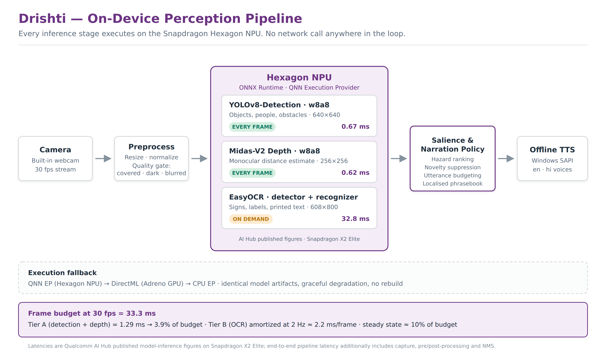

# Drishti

A fully offline visual assistant for blind and low-vision users, built for the
Snapdragon Hexagon NPU on Snapdragon-powered HP PCs.

Point the laptop's camera at the world and Drishti speaks what matters: what is in
front of you, how far away it is, and which way it lies — plus anything readable in
view, on request. No internet, no account, no cloud inference, no recurring cost.



**Documents** — [`docs/brief.pdf`](docs/brief.pdf) (project description) ·
[`docs/proposal.pdf`](docs/proposal.pdf) (full technical proposal, 13 pp) ·
[`docs/pitch.pdf`](docs/pitch.pdf) (pitch deck)

## Why this needs an NPU

Assistive perception is a continuously-running camera workload. It has to hold a
real-time frame rate for hours on battery, and it cannot wait on a network round trip
that may never come back. Those two constraints are exactly what a dedicated neural
accelerator is for.

All three models come from [Qualcomm AI Hub](https://aihub.qualcomm.com/) and run
through the ONNX Runtime QNN Execution Provider on the Hexagon NPU:

| Stage | Model | Precision | Cadence | AI Hub latency (X2 Elite) |
|---|---|---|---|---|
| Objects & obstacles | YOLOv8-Detection | w8a8 | every frame | 0.67 ms |
| Distance | Midas-V2 | w8a8 | every frame | 0.62 ms |
| Scene text | EasyOCR (detector + recognizer) | float | on demand | 32.8 ms |

Tier A costs about 1.29 ms of a 33.3 ms frame budget at 30 fps — roughly 4%. That
headroom is the point: it is what leaves room for capture, post-processing, speech,
and a duty-cycled OCR pass without ever dropping a frame.

Those are published per-model inference figures from AI Hub's device farm. End-to-end
pipeline latency is higher, because it includes capture, letterboxing, NMS and fusion.
`scripts/benchmark.py` measures that honestly and reports both.

## Install

```bash
git clone https://github.com/Rachit0910/drishti.git && cd drishti
python -m venv .venv && .venv\Scripts\activate     # Windows on Snapdragon
pip install -r requirements.txt

# On Snapdragon, replace the CPU build with the QNN build:
pip uninstall -y onnxruntime && pip install onnxruntime-qnn
```

## Get the models

Compile, quantize and profile every model on real Snapdragon silicon in AI Hub's
device farm — you do not need to own the hardware to get true on-device numbers:

```bash
qai-hub configure --api_token <token from aihub.qualcomm.com>
python scripts/export_models.py --all
```

Artifacts land in `models/`, and the measured profile lands in
`benchmarks/aihub_profile.json`.

## Run

```bash
python -m drishti.app                                    # NPU if available
python -m drishti.app --force-provider CPUExecutionProvider   # CPU baseline
```

On startup the log states which execution provider actually accepted each model. If
it is not `QNNExecutionProvider`, you are not on the NPU and the app says so rather
than quietly degrading.

## Benchmark

```bash
python scripts/benchmark.py --frames 300 --compare-cpu
```

Reports per-stage and end-to-end mean/median/p95 latency, sustained fps, and the
NPU-versus-CPU speedup. Writes `benchmarks/end_to_end.json`.

## Tests

```bash
python -m pytest tests/ -q
# or, with nothing installed but numpy:
python tests/test_policy.py     # 17 - what to say, and when to stay silent
python tests/test_geometry.py   #  9 - relative depth converted to metres
python tests/test_quality.py    # 11 - detecting that the camera cannot see
```

All 37 tests are pure and deterministic, so they run on any machine with no camera,
NPU, speaker or account. That is deliberate — the components most likely to be subtly
wrong are the ones deciding what to say and whether the camera can see, so they are
the ones that must be testable everywhere.

## How it works

```
camera ─▶ quality gate ─▶ ┌─ YOLOv8 detection ─┐ ─▶ fusion ─▶ narration policy ─▶ TTS
                          └─ Midas-V2 depth  ──┘
                             (Hexagon NPU)
```

**Detection** finds objects. **Depth** estimates how far away each one is. **Fusion**
pairs them. The **narration policy** decides which single fact, if any, is worth the
user's attention — and then the speech channel says it.

### The hard part is not detection, it is restraint

Speech is serial and slow. A naive assistant pipes every detection into a TTS engine
and produces `chair chair chair person chair`, which users switch off within a minute.
`drishti/policy.py` is the component that prevents this:

- **Salience scoring** — `hazard × proximity × centrality × confidence`. A car two
  metres dead ahead outranks a bench four metres to the side.
- **Critical override** — a HIGH or CRITICAL hazard inside 1.2 m interrupts whatever
  is being spoken and leads with the actionable word (`"Stop. Car right in front of you."`),
  because the user may only hear the first syllable.
- **Novelty suppression** — the same fact is never repeated until it materially
  changes. Approaching is news; receding is not.
- **Utterance budgeting** — a hard ceiling on routine utterances per window. When the
  budget is spent, Drishti stays quiet rather than babbling.

### Silence is ambiguous

Drishti's correct behaviour in an empty corridor is silence. Its behaviour when a
thumb is over the lens is *also* silence. A sighted user resolves that instantly by
glancing at the camera; a blind user — the only user this has — cannot, and has no way
to tell "nothing to report" from "I have been blind for four minutes".

So `drishti/quality.py` announces degraded input rather than swallowing it, and
distinguishes three conditions because the remedy differs for each:

| Condition | Spoken | Remedy |
|---|---|---|
| Dark **and** featureless | "Camera is covered." | move your hand |
| Dark but textured | "Too dark to see." | turn on a light |
| No sharp edges | "Camera image is blurred." | hold steadier |
| Recovered | "Camera clear." | — silence is meaningful again |

Announcements are debounced over ~0.4 s so one dropped frame never cries wolf, and a
condition is announced once rather than repeatedly.

### Speaking the user's language

No user-facing string appears anywhere in the logic. Directions, distance vocabulary,
sentence templates and camera messages all live in `drishti/phrases.py`; the policy
decides *what* to say and the phrasebook decides *how it sounds*. English and Hindi
ship today, and a test asserts no English string can leak into a Hindi utterance.

```bash
python -m drishti.app --locale hi
```

Voice selection matches: the app enumerates installed SAPI voices and picks one for
the locale, falling back to the system default with a logged warning rather than
failing to speak. Adding a language is a data change plus a system voice.

### Cold start, and why the context cache matters

Finalizing a graph on the Hexagon Tensor Processor is expensive and by default happens
on every launch — landing the delay at the worst moment, when the user has pressed the
button and is standing still, unable to see a progress indicator. `drishti/runtime.py`
dumps the compiled QNN context once (`ep.context_enable`, `ep.context_file_path`,
`ep.context_embed_mode`) and loads from it thereafter, turning finalization into a file
read. Because that cost is then paid exactly once, graph finalization is also set to
the most aggressive optimisation level, which is otherwise too slow to justify.

### Turning relative depth into metres

Midas-V2 predicts *relative inverse depth*, not distance. Reporting it as metres would
be worse than saying nothing. `drishti/geometry.py` fits the disparity map to metric
units every frame using detected objects of known physical size as anchors — a person
is a reliable 1.68 m ruler — via a least-squares fit of disparity against 1/z, smoothed
across frames. Distances are only ever as good as that calibration, and the code says
so where it matters.

## Finishing the OCR path

`TextReader.__call__` raises `NotImplementedError` at the recognizer step on purpose.
The detector runs; decoding its output needs the character set matching the exported
recognizer artifact, and `scripts/export_models.py` does not write that charset out
yet — so exporting the charset and writing the greedy CTC decode are one piece of
outstanding work, not two.

Also outstanding: a one-time camera calibration helper. `geometry.py` currently assumes
a 55 degree vertical field of view, which is a reasonable prior for a laptop webcam but
is still a prior — and every announced distance scales off it.

## Licensing note

Midas-V2 is MIT. EasyOCR follows its upstream JaidedAI license. **YOLOv8-Detection is
AGPL-3.0**, which is fine for a public research repository like this one but propagates
to anything built on it — if this were ever to ship commercially, the detector would
need swapping for a permissively-licensed one. Flagged here rather than discovered later.

## Status

| Component | Status |
|---|---|
| Narration policy, quality gate, depth calibration, localisation | Complete, 37 tests passing |
| Provider fallback chain + QNN context cache | Implemented; needs a Snapdragon device to validate |
| Model wrappers (detection / depth) | Implemented; needs exported artifacts to validate |
| AI Hub export + profile script | Implemented; needs an AI Hub API token |
| End-to-end benchmark harness | Implemented; runs headless on synthetic frames |
| OCR recognizer decode | Stubbed — see above |

Nothing here is claimed as working that has not been run.
